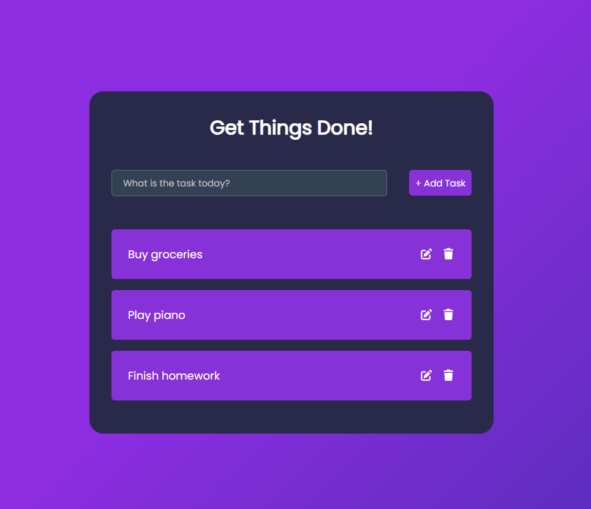

# Todo App

This is a simple yet functional Todo application built with React and Vite. It allows users to manage their tasks through a clean and responsive user interface. The application performs full CRUD (Create, Read, Update, Delete) operations by interacting with a mock REST API backend.



## Features

- **Add Tasks**: Quickly add new tasks to your list.
- **Edit Tasks**: Modify existing tasks inline.
- **Delete Tasks**: Remove tasks you no longer need.
- **Mark as Complete**: Toggle the completion status of a task.
- **API Integration**: All tasks are fetched from and persisted to a remote API.
- **Loading & Error States**: The UI provides feedback during API requests and displays relevant error messages.
- **Responsive Design**: The layout adapts to both desktop and mobile screen sizes.

## Tech Stack

- **Frontend**: React, Vite
- **API Communication**: Axios
- **Icons**: FontAwesome
- **Styling**: CSS with Flexbox

## Getting Started

Follow these instructions to get a copy of the project up and running on your local machine for development and testing purposes.

### Prerequisites

- [Node.js](https://nodejs.org/) (v18 or later recommended)
- npm (comes with Node.js)

### Installation

1.  **Clone the repository:**

    ```sh
    git clone https://github.com/chamodya-work/Todo-App-APS.git
    ```

2.  **Navigate to the project directory:**

    ```sh
    cd Todo-App-APS
    ```

3.  **Install dependencies:**
    ```sh
    npm install
    ```

### Environment Configuration

This project requires a connection to a mock API service.

1.  Create a `.env` file in the root of the project by copying the example file:

    ```sh
    cp .env.example .env
    ```

2.  Sign up for a free account at a service like [mockapi.io](https://mockapi.io/). Create a new project and a resource named `todos`. The `todos` resource should have the following fields:

    - `id` (Object ID)
    - `createdAt` (Date)
    - `text` (String)
    - `completed` (Boolean)

3.  Open the newly created `.env` file and replace `your_mockapi_base_url_here` with your mock API's base URL.

    **`.env`**

    ```
    VITE_MOCKAPI_BASE_URL=https://your-unique-id.mockapi.io/
    ```

### Running the Application

- **To start the development server:**
  ```sh
  npm run dev
  ```
  The application will be available at `http://localhost:5173`.

## Available Scripts

- `npm run dev`: Starts the development server with Hot Module Replacement (HMR).
- `npm run build`: Bundles the application for production into the `dist` folder.
- `npm run lint`: Runs ESLint to analyze the code for potential errors.
- `npm run preview`: Starts a local server to preview the production build from the `dist` folder.

## Assumptions & Design Decisions Made

- `API Backend Choice`: use of a mock REST API (e.g., via mockapi.io) for development and testing, as per the assignment's suggestions.

- `Data Mapping`: Task descriptions are stored and fetched using the text field in API payloads, aligning with the sample API structure provided in the assignment.

- `Editing Approach`: Editing is handled inline with local state updates for toggling edit mode (using `isEditing` flag), improving UX by avoiding unnecessary API calls for UI changes. Actual updates fetch fresh data after API operations.

- `Validation and Feedback`: Added client-side validation to prevent empty tasks, with immediate error messages

## Limitations & Areas for Improvement

- `Security`: No authentication, so all tasks are public/shared.

- `Responsiveness`: Tested on common breakpoints, but edge cases might need fine-tuning.

- `Cross-Browser Compatibility`: Primarily tested in modern browsers. older ones (e.g., IE) may have issues with CSS gradients or hooks.

## Project Structure

```
/
├── public/              # Static assets
├── src/
│   ├── api.js           # Axios instance and API call definitions
│   ├── App.css          # Global styles for the application
│   ├── App.jsx          # Root component
│   ├── main.jsx         # Application entry point
│   ├── components/      # Reusable React components
│   │   ├── Todo.jsx         # Displays a single todo item
│   │   ├── TodoForm.jsx     # Form for adding new todos
│   │   ├── EditTodoForm.jsx # Form for editing a todo
│   │   └── TodoWrapper.jsx  # Main component that orchestrates all todo functionalities
│   └── hooks/
│       └── useTodos.js    # Custom hook for managing todo state and API interactions
├── .env.example         # Environment variable template
├── package.json         # Project dependencies and scripts
└── vite.config.js       # Vite configuration
```
